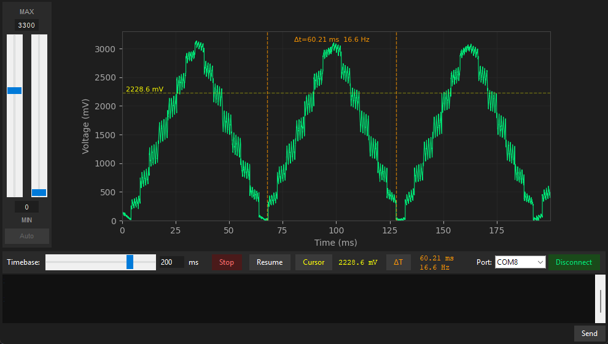

# ESP32 Wi-Fi Scope

Single-channel 12-bit oscilloscope built on an ESP32-S3. Samples internal ADC @ 60 KS/s and streams frames over serial, with Wi-Fi transport planned for a future revision.

## Parameters

| Parameter | Value |
|-----------|-------|
| Channels  | 1 |
| Bandwidth | TBA |
| Sample rate | 60 KS/s |
| Resolution | 12-bit |
| Voltage input range | 0 - 3.3V |

## Hardware

Current version of project is built only using ESP32-S3 DevKitC-1, with optional start/stop button and status LED. No additional hardware required. Future revision planned to include custom PCB with external ADS930E 8-bit ADC, as well as signal conditioning and coupling circuit.

**Components:**

- ESP32-S3 DevKitC-1

*Optional components*
- User button
- LED

**Pinout:**

| **ESP32-S3 Pin** | **Function** |
|------------------|--------------|
| GPIO1 | ADC1 CH0 — signal input |
| GPIO21 | *Optional* User button (start/stop) |
| GPIO4 | *Optional* Status LED (on/off, indicator) |
| UART0 TX/RX | Serial data & CLI (1 Mbps) |

## Architecture

The firmware is designed around FreeRTOS (1 kHz tick), ISR callbacks, and an event-driven Capture and Oscilloscope threads.

**Data path:**

1. ADC1 runs in continuous DMA mode at 60 KSps. On conversion done ISR, `Capture API` collects and converts samples to millivolts via `Voltage API` and pushes them into a ring buffer.
2. The Capture API posts a `CAPTURE_DONE_EVENT` every `CAPTURE_ELEMENTS` 256 samples (~4.3 ms). The Oscilloscope thread wakes on this event and pops these samples from the ring buffer into the frame accumulation buffer.
3. A FreeRTOS software timer fires at `FRAMES_PER_SECOND` (every 50 Hz or 20 ms), posting a `FRAME_DONE_EVENT`. The thread packages all accumulated bytes, prepends a text header, and sends over UART.

**Frame format:**

```
<timestamp_ticks> <frame_number> <total_bytes>\n
<uint16_t millivoltage samples — up to 1 KB (512 samples) per chunk>
```

## Firmware

Firmware is based on [PDF (Pofkinas Development Framework)](https://github.com/Pofkinas/pdf) hardware abstraction layer, adapted to function with ESP32-S3. A future goal is planned to support different MPUs within the same framework build.

**Custom CLI commands** (send over serial terminal):

```
scope_start  -  Start ADC capture and frame streaming
scope_stop   -  Stop capture and clear buffer
```

## Software

Python GUI and utility scripts in `Software/`. Currently the firmware is designed to be run locally via the Python app over serial. A future revision is planned where the ESP32 hosts a web interface over Wi-Fi. All rendering and analysis would run in the browser.



### `scope.py` — Oscilloscope App

Oscilloscope front-end based on Python Tkinter. Features:

- Serial port connect/disconnect
- Sends `scope_start` / `scope_stop` commands to ESP32
- Voltage range 0 V to 5 V
- Timebase from 1 µs/div to 5 s/div
- Horizontal voltage cursor
- Delta_t markers for time-interval measurement
- Autoscale toggle
- Pause / resume frame
- Console for debug information and commands

### `frame_reader.py` — Frame Reader

Serial frame parsing layer. Provides an abstract `FrameReader` interface and a `SerialFrameReader` implementation. Parses the header, reads and exposes `uint16_t` voltage samples. Supports debug information forwarding via callback. Can also be used standalone as a CLI frame printer.

### `scope_plot.py` — Plot Widget

Handles waveform rendering, cursor and delta_t markers interaction, voltage range, and autoscale.

### Dependencies

Software dependancies can be found in `requirements.txt`

```
pip install -r Software/requirements.txt
```

## Build & Flash

### Firmware

Firmware supports both **CMake (ESP-IDF)** and **PlatformIO**. Clang-format integration and file templates are provided. Auto-formatter is set up in VSCode on file save, or run manually via script.

**Clang-format (PowerShell):**
```powershell
.\Firmware\clang_format.ps1
```

## Current Limitations

- Currently doesn't support trigger functionalities.
- Internal `ADC_UNIT_1` is limited to ~60 KS/s. Input range is unipolar 0–3.3 V, with no negative voltages.
- ESP32-S3 internal ADC has known non-linearity (INL up to ±50 LSB). Readings are only usable for relative measurements.
- No FFT or signal analysis tools.

## License

This project is licensed under the GNU General Public License v3.0. See the [LICENSE](LICENSE) file for more details.
