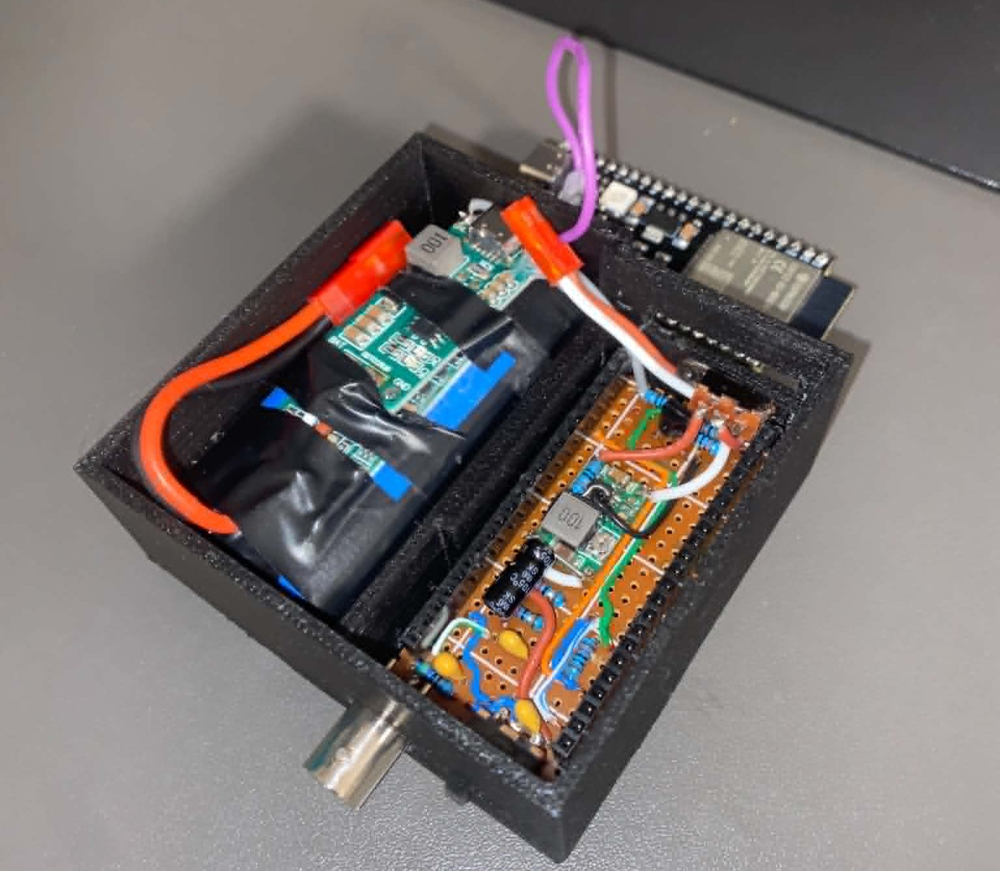
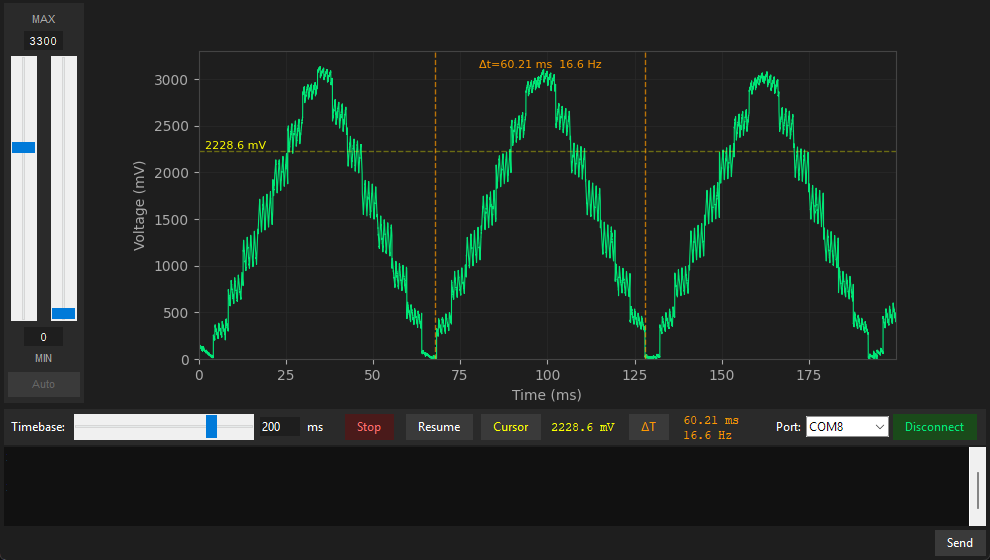

# ESP32 Wi-Fi Scope

Single-channel 12-bit oscilloscope built around ESP32-S3. The internal ADC samples at 50 kS/s and streams frames to a PC over either USB (UART) or Wi-Fi (UDP). A Python GUI handles rendering and control.



## Parameters

| Parameter | Value |
|-----------|----------|
| Channels | 1 |
| Bandwidth | 20 kHz |
| Sample rate | 50 kS/s |
| Resolution | 12-bit |
| Voltage input range | 0 – 3 V |
| Rise time | 17.5 µs |
| Record depth | 5 242 880 pts (~105 s) |
| Wireless latency | 1.14 ms avg |
| Battery life (Wi-Fi) | ~25 h |

## Hardware

The project is built as an expansion board on top of an ESP32-S3-DevKitC-1. The expansion handles the analog input (BNC → RC low-pass → ADC), the AC/DC coupling switch, status LEDs, and a start/stop button. A BC547B transistor gates the *EN* pin of the MH-MINI-360 board *MP2307*. When USB-C is plugged in, the battery buck converter is disabled and the dev board runs (and charges the cells) from USB 5 V instead. See `Docs/scope_schematic.png`.

**Components:**

- ESP32-S3-DevKitC-1 (WROOM-1, N16R8)
- RC low-pass filter on the input — R = 470 Ω, C = 10 nF
- AC/DC coupling switch
- 2× Samsung 18650 20R cells in series + BMS + charger module
- MH-MINI-360 buck converter to 3.3 V
- BC547B + a 10 k resistor for base

**Pinout:**

| ESP32-S3 Pin | Function |
|--------------|----------|
| GPIO1 | Analog input |
| GPIO21 | Start/stop button |
| GPIO4 | Status LED |
| GPIO7 | USB-detect input (selects transport mode) |
| UART0 TX/RX | Serial data + CLI (2 Mbps) |

When USB is plugged in, the firmware drops Wi-Fi and routes frames over UART. Unplugging it brings Wi-Fi up and switches transport to UDP.

## Firmware

Built on ESP-IDF v5.5.3 with FreeRTOS, using ESP flavor of [PDF (Pofkinas Development Framework)](https://github.com/Pofkinas/pdf).

### Data path

1. **ADC1** runs in continuous DMA mode at 50 kS/s. Every 256 samples (~5 ms) the driver fires an ISR.
2. **Capture API** picks up the conversion-done event, converts in-place raw ADC counts to millivolts via the **Voltage API**, and pushes the samples into a ring buffer.
3. Each `CAPTURE_DONE_EVENT` wakes the oscilloscope thread, which pops samples into the frame accumulator.
4. A FreeRTOS software timer fires at 50 Hz (every 20 ms). On `FRAME_DONE_EVENT` the thread builds a header, then sends the header + accumulated bytes through the **Transport API** (which abstracts UART and UDP).

### Frame format

```
<timestamp_ticks> <frame_number> <total_bytes>\n
<uint16_t mV samples — up to 1024 bytes per chunk, little-endian>
```

## Build & Flash

Firmware builds with both **PlatformIO** and **ESP-IDF CMake**. Clang-format runs on save in VSCode, or manually:

```powershell
.\Firmware\clang_format.ps1
```

## Software

Python 3 GUI in `Software/`. Talks to the firmware either over a serial port or by listening on a UDP socket and sending control commands back to a known IP. Both modes share similar parsing and rendering code.



- `frame_reader.py` — `FrameReader` abstract interface with `SerialFrameReader` and `WirelessFrameReader` implementations. Header is parsed and payload is unpacked as little-endian `uint16_t`. Can be run standalone to dump frames to stdout for debugging.
- `scope_plot.py` — Matplotlib plot embedded in Tk, with a voltage cursor, a ΔT pair of markers, autoscale, and a timebase slider.
- `scope.py` — Manages the frame reader and data plotting, handles the connect/disconnect bar and the debug console for arbitrary CLI commands.

Install:

```
pip install -r Software/requirements.txt
python Software/scope.py
```

## Known Limits

- **Input impedance is ~445 Ω.** This is way too low as the input loads the circuit and distorts the measurement.
- **No negative voltages, limited to 3 V input.** Adding an op-amp buffer + divider for level-shifting and attenuation would fix both issues.
- **No hardware/software trigger.** Periodic signals visibly drift on screen, and there's no way to and analyse a captured event.
- **Internal ADC.** ESP32-S3's ADC tops out around 100 kS/s and has notable INL (up to ±50 LSB at the −12 dB attenuation we use). Fine for relative measurements, bad for accuracy.
- **Bandwidth-limited reconstruction.** Reliable up to ~4 kHz. Sine waves at 10 kHz already start looking triangular.
- **Power path is over-engineered.** A single cell + LDO + charger would do the job.

## License

This project is licensed under the GNU General Public License v3.0. See the [LICENSE](LICENSE) file for more details.
